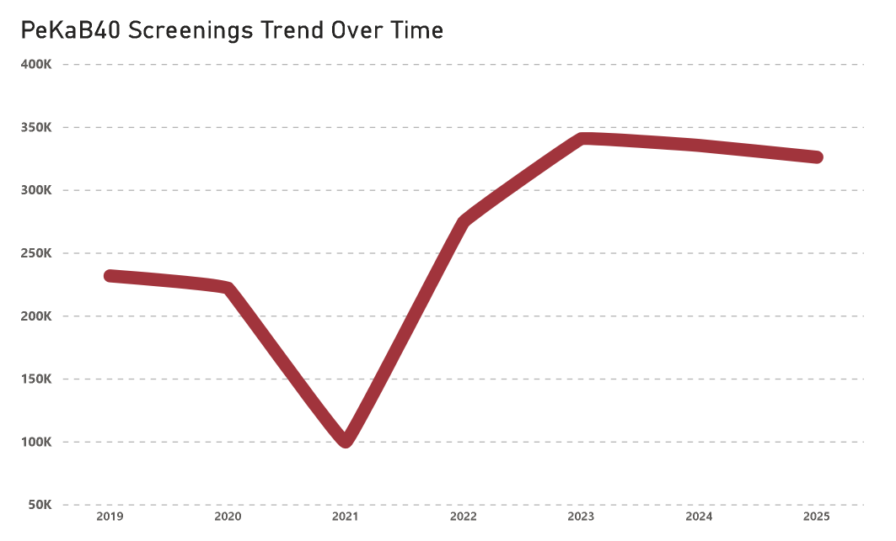
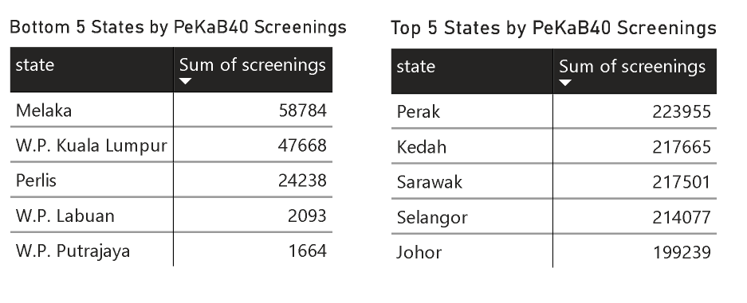
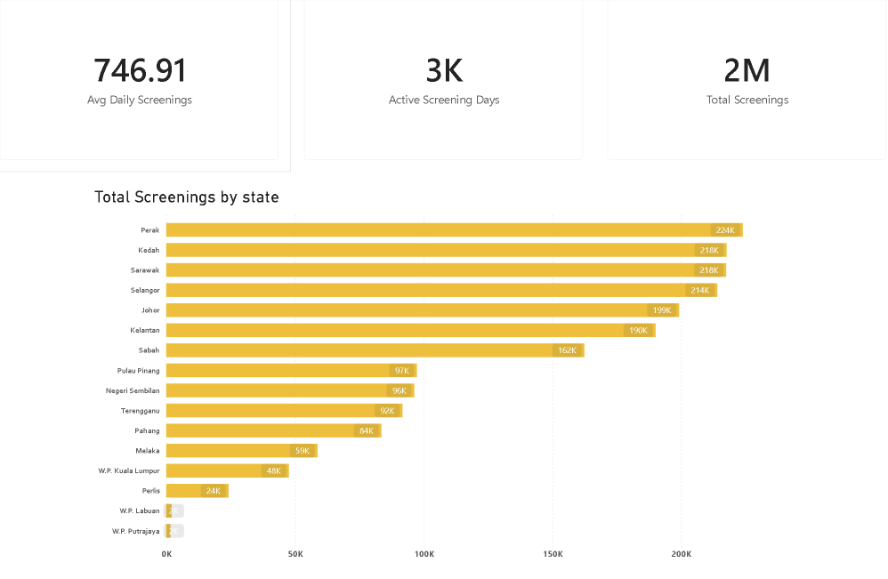
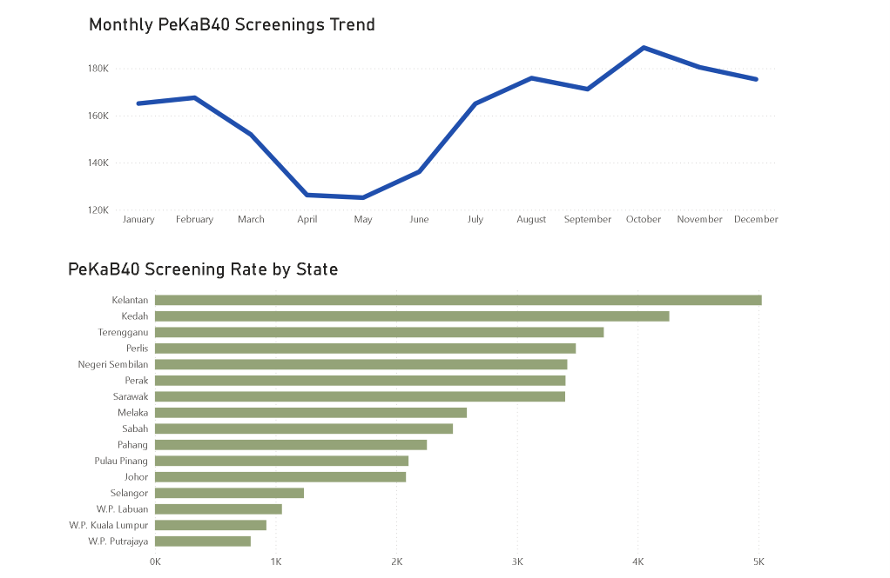
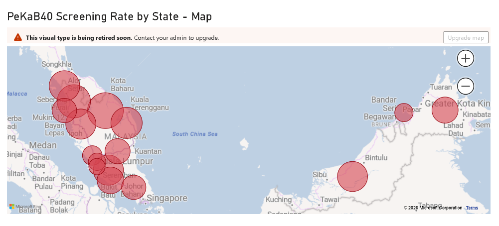
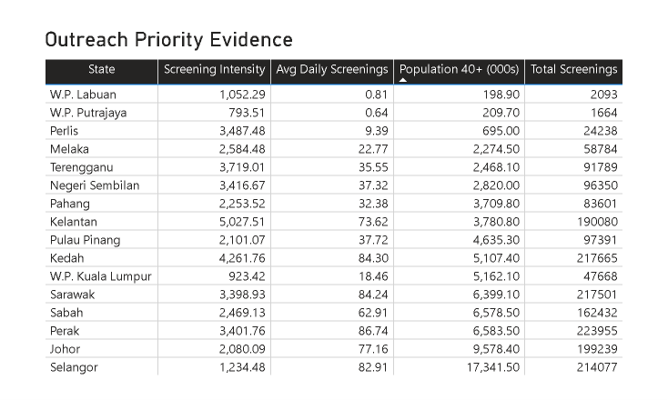

# PeKaB40 Preventive Healthcare Screening Analysis

> Power BI analysis of Malaysia's B40 free health screening programme — tracking state-level trends, coverage intensity, and outreach gaps from 2019 to 2025.


---

## Background

**PeKaB40** (Skim Peduli Kesihatan untuk Kumpulan B40) is a Malaysian Ministry of Health programme that provides free health screening to eligible Sumbangan Tunai Rahmah (STR) recipients and their registered spouses aged 40 and above. It targets non-communicable diseases (NCDs) — diabetes, hypertension, cardiovascular risks — that often go undetected until they become serious.

This project analyses PeKaB40 screening records across all Malaysian states and federal territories from 2019 to 2025. It compares yearly trends, state-level volume, and population-adjusted screening intensity to surface states that may need closer outreach review.

---

## Research Questions

1. How did PeKaB40 screening activity change across Malaysia from 2019 to 2025?
2. Which states recorded the highest and lowest total screening volume?
3. After adjusting for population aged 40+, which states show lower screening intensity and may warrant further outreach investigation?

---

## Tools

| Tool | Purpose |
|---|---|
| Power BI Desktop | Dashboard development and visualisation |
| Power Query | Data cleaning and transformation |
| DAX | Calculated measures and KPIs |
| CSV datasets | Source data (screenings + population) |

---

## Data Sources

- [Daily PeKaB40 Health Screenings by State](https://data.gov.my/data-catalogue/pekab40_screenings_state) — data.gov.my
- [Population Table by State](https://data.gov.my/data-catalogue/population_state) — data.gov.my
- [`data/cleaned/population_40plus_by_state_year.csv`](data/cleaned/population_40plus_by_state_year.csv) — derived from the population dataset, filtered to age groups 40+

---

## Methodology

The PeKaB40 screening dataset was joined with state-level population data filtered to age groups 40–44 and above, then aggregated by state and year to produce an eligible-population denominator.

**Screening intensity** is calculated as:

$$\text{Screening Intensity} = \frac{\text{Total Screenings}}{\text{Population Aged 40+}} \times 100{,}000$$

This normalises screening volume against the approximate eligible population, allowing fairer cross-state comparison than raw totals alone.

> Full methodology: [`docs/methodology.md`](docs/methodology.md) — Data definitions: [`docs/data_dictionary.md`](docs/data_dictionary.md)

---

## Dashboard Preview

The dashboard is split into two sections:

- **Overview** — screening trends, state totals, and geographic distribution
- **Outreach Priority** — population-adjusted intensity and evidence for lower-intensity states

### Overview

#### Screenings Trend Over Time

<p align="center">
  
</p>

Annual screening records dropped sharply in 2021, recovered strongly through 2022–2023, then saw a mild decline in 2024–2025. The 2021 trough and 2023 peak are the two most notable inflection points in the series.

---

#### Top and Bottom 5 States by Total Screenings

<p align="center">
  
</p>

Perak, Kedah, Sarawak, Selangor, and Johor lead by total volume. W.P. Putrajaya and W.P. Labuan sit at the bottom. Raw totals reflect population size — they should be read alongside screening intensity before drawing outreach conclusions.

---

#### Total Screenings by State

<p align="center">
  
</p>

KPI cards show total screening records, active screening days, and average daily screenings alongside a ranked state bar chart. Larger states naturally dominate raw counts.

---

#### Monthly Screenings Trend and State Screening Intensity

<p align="center">
  
</p>

Monthly patterns show weaker activity around April–May and stronger activity later in the year. State-level intensity variation is visible even within the same raw-volume tier.

---

#### Screening Intensity by State — Map

<p align="center">
  
</p>

Geographic view of population-adjusted intensity. East Malaysian states and several northern peninsular states show relatively higher intensity; federal territories cluster at the lower end.

---

### Outreach Priority

> Screening intensity uses population aged 40+ as a proxy denominator, not the exact eligible B40/STR count by state.

#### Screening Intensity per 100,000 Population Aged 40+

<p align="center">
  
</p>

Kelantan ranks highest in screening intensity. W.P. Putrajaya, W.P. Kuala Lumpur, and W.P. Labuan sit noticeably below the national trend, flagging them as priority areas for outreach review.

---

#### Outreach Priority Evidence Table

<p align="center">
  
</p>

Side-by-side comparison of screening intensity, average daily screenings, population aged 40+, and total records by state. Low intensity in the three federal territories may reflect awareness gaps, access barriers, eligible-population differences, or cross-border healthcare usage into neighbouring Selangor — further investigation is needed before drawing conclusions.

> Additional screenshot notes: [`screenshots/README.md`](screenshots/README.md)

---

## Key Insights

1. Screening activity collapsed in 2021 — the weakest year in the 2019–2025 window — before recovering to a 2023 peak.
2. Post-peak decline continued into 2024–2025, warranting monitoring to determine whether a new outreach push is needed.
3. Kelantan recorded the highest screening intensity per 100,000 population aged 40+.
4. W.P. Putrajaya recorded the lowest screening intensity of any state or federal territory.
5. W.P. Putrajaya, W.P. Kuala Lumpur, and W.P. Labuan all fall significantly below the median intensity — the strongest evidence for outreach prioritisation.

---

## Recommendations

- **Investigate the three federal territories** (W.P. Putrajaya, W.P. Kuala Lumpur, W.P. Labuan) for awareness gaps, clinic access barriers, or cross-state healthcare usage before assuming low uptake.
- **Use Kelantan as a reference case** — understand what is driving its above-average intensity and assess whether those conditions can be replicated elsewhere.
- **Monitor the post-2023 decline** — a continued downward trend would justify a targeted national outreach campaign.
- **Refine the denominator** — if eligible B40/STR population counts by state become available, replace the 40+ population proxy for more accurate intensity measurement.

---

## Limitations

- Screening intensity uses **population aged 40+** as a proxy — not the exact eligible B40/STR population by state, which is not publicly available at this level of granularity.
- The dataset counts **screening records**, not unique individuals — repeat screenings are included.
- **Urban federal territories** (especially W.P. Kuala Lumpur) may undercount due to residents accessing clinics in adjacent Selangor.

> Full limitations discussion: [`docs/limitations.md`](docs/limitations.md)

---

## Repository Structure

```
malaysia-pekab40-screening-analysis/
├── dashboard/
│   └── PeKaB40_Healthcare_Screening_Dashboard.pbix
├── data/
│   ├── raw/
│   │   ├── pekab40_screenings_state.csv
│   │   └── population_state.csv
│   └── cleaned/
│       └── population_40plus_by_state_year.csv
├── screenshots/
│   ├── README.md
│   ├── screenings-trend-over-time.png
│   ├── top-and-bottom-5-states-by-total-screenings.png
│   ├── total-screenings-by-state.png
│   ├── monthly-screenings-trend-and-screenings-rate-by-state.png
│   ├── screenings-rate-by-state-map.png
│   ├── screenings-intensity-by-state-per-100000-population-aged-40+.png
│   └── outreach-priority-evidence.png
├── docs/
│   ├── methodology.md
│   ├── data_dictionary.md
│   └── limitations.md
├── measures.md
├── README.md
└── .gitignore
```

---

## How to Open the Dashboard

1. Install [Power BI Desktop](https://powerbi.microsoft.com/desktop/).
2. Open `dashboard/PeKaB40_Healthcare_Screening_Dashboard.pbix`.
3. If prompted about data source paths, confirm the CSV files are present in the `data/` folder.
